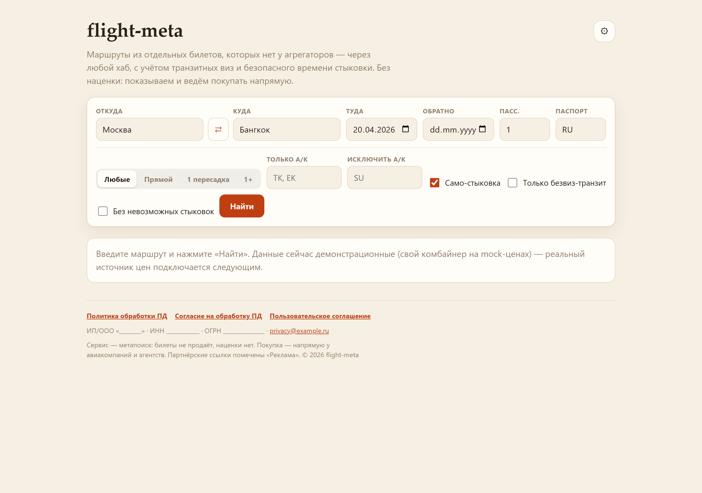
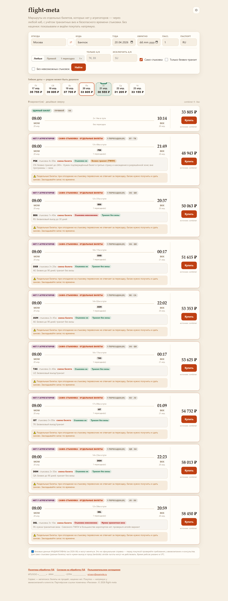
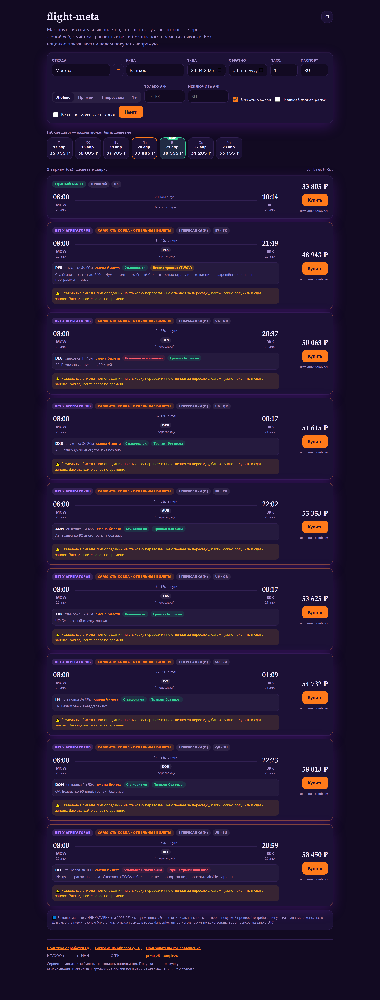

# flight-meta

**Flight metasearch that surfaces self-transfer routes the big aggregators never show — with transit-visa logic for RU/CIS passports and no markup on the traveller.**

English · [Русский](#flight-meta--ru)



## What it is

Aggregators like Aviasales only sell routes ticketed as a **single GDS fare**. They won't stitch two separate tickets from different airlines together — so real, often cheaper itineraries through a hub (Istanbul, Dubai, Beijing, anywhere) stay invisible. **flight-meta finds them.**

It's a pure **metasearch with no markup**: find, compare, redirect to the airline or agency to buy. Revenue is affiliate-based, never a fee on the traveller — which is the honest meaning of "no commission".

## Highlights

- **Self-transfer combiner.** A homegrown engine (`internal/combiner`) stitches `A→hub` + `hub→B` from separate tickets into one itinerary, checking connection time and transit visa along the way. Route-agnostic — any hub, no hardcoded country.
- **Transit-visa awareness (RU/CIS).** Every connection is scored against the traveller's passport: visa-free / TWOV (e.g. China, with conditions) / visa required / unknown, with an *airside vs. landside* nuance. Filter to visa-free transits only.
- **Connection-time safety.** Each layover is graded `safe / risky / infeasible` against minimum connection times; self-transfers demand a bigger buffer, and a visa-requiring landside change is flagged infeasible.
- **Flexible dates.** A price calendar shows nearby days and highlights the cheapest one.
- **Human search.** No airport codes in the UI — type a **city or country** by name; pick a country and it fills its main city.
- **Theming + RU compliance.** Three themes (warm editorial · dark neon · neo-brutalist), adjustable font/size/density, **system fonts only** (no foreign font CDN — speed + RU data rules). Privacy/consent pages, consent banner, owner details in the footer.

| Results — warm theme | Results — dark theme |
|---|---|
|  |  |

## How it works

Kiwi/Tequila isn't available, so unique routes come from the **own combiner**: it pulls per-leg prices from a `sources.LegSource`, walks candidate hubs, and assembles self-transfer offers — then enrichment passes add transit-visa status and connection risk before ranking. A real price feed (e.g. Travelpayouts) just implements `LegSource` and drops in where `mockleg` sits today, with nothing else in the pipeline changing.

> Status: the full pipeline runs end-to-end on a **mock leg source**. Everything except the live price feed is implemented.

## Stack

Go (goroutine fan-out with per-source timeouts) · React + Vite + TypeScript · Docker / Compose · Helm/K8s planned.

## Run locally

```bash
# backend
go run ./cmd/api
curl "http://localhost:8080/search?origin=MOW&destination=BKK&depart=2026-04-20"

# frontend (Vite dev proxies /api → :8080)
cd web && npm install && npm run dev   # http://localhost:5173
```

Or with Docker: `docker compose up --build`. Production frontend build: `cd web && npm run build` (API base via `VITE_API_BASE`, default `/api`).

## API

`GET /health` → `{"status":"ok"}`

`GET /search` — parameters:

| Param | Req. | Example | Notes |
|---|---|---|---|
| `origin` | yes | `MOW` | departure IATA (the UI maps city/country → code) |
| `destination` | yes | `BKK` | destination IATA |
| `depart` | yes | `2026-04-20` | `YYYY-MM-DD` |
| `return` | no | `2026-04-27` | one-way if omitted |
| `passengers` | no | `2` | 1..9, default 1 |
| `passport` | no | `RU` | drives transit-visa logic |
| `currency` | no | `RUB` | price currency |
| `stops` | no | `direct` / `one` / `one_plus` | stops filter |
| `airlines` | no | `TK,EK` | only these carriers |
| `exclude_airlines` | no | `SU` | drop these carriers |
| `self_transfer` | no | `false` | turn off self-transfer offers |
| `visa_free_transit` | no | `true` | visa-free transits only |
| `hide_infeasible` | no | `true` | hide impossible connections |

`GET /calendar` — same params + `window` (1..14 days each side) → `{ days: [{ date, priceMinor, currency, hasOffers, cheapest }] }`.

`/search` returns `{ offers, sources, visaDisclaimer }`. Self-transfer offers carry `connection: "self_transfer"` and usually `unique: true`; layovers carry `visaStatus` and `transitNote`.

## Layout

```
cmd/api             service entry point
internal/offer      source-agnostic Offer model (no deps)
internal/sources    Adapter + LegSource; mockleg/ — stub leg prices
internal/combiner   the combiner: A→hub→B self-transfer assembly
internal/search     fan-out, merge, enrichment (visa, connections), ranking, /calendar
internal/rank       filters (stops, carriers, self-transfer, visa, risk) + sorting
internal/visa       transit visas: embedded RU/CIS rule base, resolver, badges
internal/connection MCT scoring (safe/risky/infeasible)
internal/config     env settings (secrets stay server-side)
internal/httpapi    HTTP/JSON, request validation, security headers
web/                React + Vite + TypeScript
deploy/             Dockerfile (Helm/K8s to follow)
```

> Transit-visa data in `internal/visa/data/*.json` is **indicative** (as of 2026-06), embedded via `go:embed`. Not an official reference — an authoritative source (Timatic/sherpa) plugs in later.

## Roadmap

- Real leg-price feed via `sources.LegSource` (Travelpayouts) in place of `mockleg`.
- Rate limiting, security review, Helm/K8s, metrics.
- Authoritative transit-visa source.

RU legal/compliance checklist (operational tasks included) lives in [`COMPLIANCE.md`](COMPLIANCE.md).

---

<a name="flight-meta--ru"></a>

# flight-meta · RU

**Метапоиск авиабилетов, который находит само-стыковочные маршруты, которых нет у крупных агрегаторов — с визово-транзитной логикой под паспорта РФ/СНГ и без наценки пользователю.**

[English](#flight-meta) · Русский

## Что это

Агрегаторы (Aviasales и др.) показывают только маршруты, продающиеся как **единый билет** в GDS. Они не «склеивают» два отдельных билета разных авиакомпаний — поэтому реально существующие и часто более дешёвые маршруты через любой хаб (Стамбул, Дубай, Пекин, что угодно) остаются невидимыми. **flight-meta их находит.**

Модель — **метапоиск без наценки**: находим, сравниваем, отправляем покупать к авиакомпании или агентству (редирект). Доход — партнёрские отчисления, а не сбор с путешественника. Это и есть честный смысл «без комиссии».

## Ключевое

- **Свой комбайнер само-стыковок** (`internal/combiner`): склеивает `A→хаб` + `хаб→B` из отдельных билетов в один маршрут, проверяя время стыковки и транзит-визу. Route-agnostic — любой хаб, без привязки к стране.
- **Транзит-визы РФ/СНГ.** Каждая стыковка оценивается под паспорт: без визы / TWOV (напр. Китай, с условиями) / нужна виза / уточните, с различием *airside vs. landside*. Есть фильтр «только безвиз-транзит».
- **Безопасное время стыковки** (`internal/connection`): оценка `safe / risky / infeasible` по минимальному времени пересадки; само-стыковке нужен запас побольше, а landside-пересадка с визой помечается невозможной.
- **Гибкие даты.** Календарь цен показывает соседние дни и подсвечивает самый дешёвый.
- **Человеческий поиск.** Никаких кодов в интерфейсе — вводите **город или страну** по названию; выбор страны подставляет её главный город.
- **Темы + РФ-комплаенс.** Три темы (тёплая журнальная · тёмная неоновая · необрутализм), выбор шрифта/размера/плотности, **только системные шрифты** (без иностранного font-CDN — скорость и правила по данным). Страницы политики/согласия, баннер согласия, реквизиты владельца в футере.

## Как устроено

Kiwi/Tequila недоступен, поэтому уникальные маршруты строит **собственный комбайнер**: берёт per-leg цены из `sources.LegSource`, перебирает хабы и собирает само-стыковочные офферы — затем обогащение добавляет статус транзит-визы и риск стыковки перед ранжированием. Реальный фид цен (например Travelpayouts) реализует `LegSource` и встаёт на место `mockleg` без изменений остального конвейера.

> Статус: весь конвейер работает end-to-end на **mock-источнике плеч**. Реализовано всё, кроме живого фида цен.

## Стек

Go (конкурентный fan-out с таймаутами на источник) · React + Vite + TypeScript · Docker / Compose · далее Helm/K8s.

## Запуск

```bash
# бэкенд
go run ./cmd/api
curl "http://localhost:8080/search?origin=MOW&destination=BKK&depart=2026-04-20"

# фронт (Vite dev проксирует /api → :8080)
cd web && npm install && npm run dev   # http://localhost:5173
```

Через Docker: `docker compose up --build`. Прод-сборка фронта: `cd web && npm run build`.

## Тесты

```bash
go test ./cmd/... ./internal/...   # web/node_modules содержит чужой Go-пакет — не сканируем ./...
```

## Данные виз

Транзит-визовые данные в `internal/visa/data/*.json` — **индикативные** (на 2026-06) и встроены в бинарь через `go:embed`. Это не официальная справка; позже подключается авторитетный источник (Timatic/sherpa). Полный чек-лист РФ-комплаенса — в [`COMPLIANCE.md`](COMPLIANCE.md).

---

Автор / Built by **[salim4ek](https://github.com/salim4ek)**.
